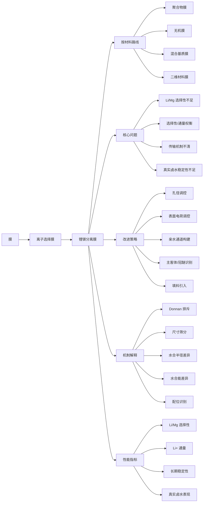

# 锂镁分离膜知识树


```mermaid
flowchart LR
  A["膜"] --> B["离子选择膜"]
  B --> C["锂镁分离膜"]

  C --> M["按材料路线"]
  M --> M1["聚合物膜"]
  M --> M2["无机膜"]
  M --> M3["混合基质膜"]
  M --> M4["二维材料膜"]

  C --> Q["核心问题"]
  Q --> Q1["Li/Mg 选择性不足"]
  Q --> Q2["选择性/通量权衡"]
  Q --> Q3["传输机制不清"]
  Q --> Q4["真实卤水稳定性不足"]

  C --> S["改进策略"]
  S --> S1["孔径调控"]
  S --> S2["表面电荷调控"]
  S --> S3["亲水通道构建"]
  S --> S4["主客体/冠醚识别"]
  S --> S5["填料引入"]

  C --> G["机制解释"]
  G --> G1["Donnan 排斥"]
  G --> G2["尺寸筛分"]
  G --> G3["水合半径差异"]
  G --> G4["水合能差异"]
  G --> G5["配位识别"]

  C --> P["性能指标"]
  P --> P1["Li/Mg 选择性"]
  P --> P2["Li+ 通量"]
  P --> P3["长期稳定性"]
  P --> P4["真实卤水表现"]
```

## 阅读规则

这张图只放技术主干。具体论文不作为主干节点，只在对应分支下作为证据出现。

## 论文挂载方式

```text
锂镁分离膜
└── 核心问题：传输机制不清
    └── 机制解释：水合半径差异
        └── 证据文献：Zhang2024LithiumIonSelectivity
```

