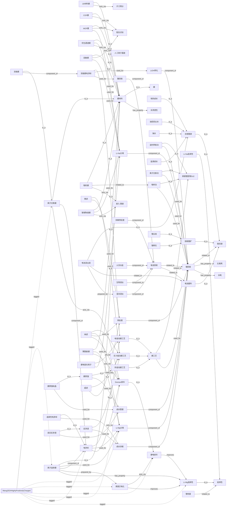

# MVP Knowledge Graph

概念节点来自 `04_Concept_Nodes/`，论文连接来自定位卡的 `concepts` 字段。

```mermaid
flowchart LR
  concept-dbf1d2b6539bef2d["2D材料膜"]
  concept-c2f3bc9ffcee427d["COF膜"]
  concept-38756aafa250f405["Donnan排斥"]
  concept-05414060b73bbbcf["Li-Mg分离"]
  concept-85a95296490a1ae7["Li-Mg选择性"]
  concept-808d0e25cc545d79["Li-Na分离"]
  concept-c76db8188abb74a8["Li-Na选择性"]
  concept-a52bccadc267e252["LiOH转化"]
  concept-6978f4ac65e570b3["MOF膜"]
  concept-1d7390547df6c370["人工离子通道"]
  concept-5e65532181210f70["仿生通道膜"]
  concept-c0378442fdf59c9a["冠醚膜"]
  concept-248b26ed54d501b7["卤水浓缩"]
  concept-1fbced5107f74ed2["卤水管理"]
  concept-0271e544f234d67b["压力驱动膜工艺"]
  concept-1963a803315475d3["双极膜"]
  concept-9ed0f3dc7adbc040["双极膜电渗析"]
  concept-f39bf880bf67358d["反渗透"]
  concept-0bbd457ed95a805a["吸附法"]
  concept-a826aa39bdbb96fc["吸附膜"]
  concept-b9c5b791fbf2339f["固相锂矿"]
  concept-70034dddeca1348a["地热卤水"]
  concept-80cbbd2a0e91593d["尺寸筛分"]
  concept-db9c18b47bc3436f["嵌入-脱嵌"]
  concept-cb26f42a10031939["微滤"]
  concept-85dd84efa223fd0c["拆解预处理"]
  concept-92bdf341b2f67481["比能耗"]
  concept-7e0e92672c36e3f3["水渗透性"]
  concept-05e5db2d8d0a2f4a["水相锂源"]
  concept-2ef030f119f4d911["水耗"]
  concept-da32b4b022ec2bae["油田采出水"]
  concept-42c431bd7b2b3c4a["海水"]
  concept-64eccf3d882b1d8f["湿法浸出"]
  concept-a0e3b8af0fc68a47["溶剂萃取法"]
  concept-69740bc1c90c2b2d["火法冶金"]
  concept-b3c8b5ff4f3891b7["热驱动膜工艺"]
  concept-99b6119001df2349["玻璃陶瓷膜"]
  concept-385b370112e23252["生物浸出"]
  concept-098b870319a7a3d6["电池回收"]
  concept-814b093fbc71b9b5["电池废料"]
  concept-a8413435c303619b["电池浸出液"]
  concept-5612d81de4250bac["电渗析"]
  concept-11cef29796ad1f6b["电驱动膜工艺"]
  concept-54ca97b8bfa73530["盐湖卤水"]
  concept-d3e6a97f01c0735c["直接锂提取DLE"]
  concept-eed8d59c77a6659a["离子交换法"]
  concept-d458203dc7ccee08["离子交换膜"]
  concept-f4bb832fba83254f["离子选择膜"]
  concept-a9f4749797725557["纳滤"]
  concept-00aff774158ff375["聚酰胺膜"]
  concept-bcea1c87f145b817["膜"]
  concept-17d7f106be82ab77["膜工艺"]
  concept-ce8ce09c94edcb22["膜材料"]
  concept-13c1f3fb2880c61f["膜电容去离子"]
  concept-4f4fab85b5f5bdb5["膜蒸馏"]
  concept-8ec32fc6e9729eef["膜蒸馏结晶"]
  concept-54c9d69e4ab86043["表面正电化"]
  concept-4aba571acc235b6f["超滤"]
  concept-d5209dac1c256350["选择性"]
  concept-eb95c9efd2d91741["选择性电渗析"]
  concept-3043efed00891338["配位识别"]
  concept-5a9cd02115deb4eb["酸回收"]
  concept-28f9a6724212f466["锂云母"]
  concept-90e77fad7450b240["锂回收"]
  concept-d3af0f76a0bee920["锂纯度"]
  concept-428349244c0075ac["锂资源"]
  concept-026bcf0ed817f4ca["锂辉石"]
  concept-ba430b1c39f61cfb["静电排斥"]
  concept-324601bddf043ecc["预处理"]
  concept-2c1c0088a07e42de["高压反渗透"]
  paper-37974a325a0b07d7[["Wang2024HighlyPositivelyCharged"]]
  concept-dbf1d2b6539bef2d -->|"is_a"| concept-ce8ce09c94edcb22
  concept-dbf1d2b6539bef2d -->|"acts_via"| concept-80cbbd2a0e91593d
  concept-c2f3bc9ffcee427d -->|"is_a"| concept-ce8ce09c94edcb22
  concept-c2f3bc9ffcee427d -->|"acts_via"| concept-3043efed00891338
  concept-38756aafa250f405 -->|"is_a"| concept-ba430b1c39f61cfb
  concept-05414060b73bbbcf -->|"component_of"| concept-90e77fad7450b240
  concept-85a95296490a1ae7 -->|"is_a"| concept-d5209dac1c256350
  concept-808d0e25cc545d79 -->|"component_of"| concept-90e77fad7450b240
  concept-c76db8188abb74a8 -->|"is_a"| concept-d5209dac1c256350
  concept-a52bccadc267e252 -->|"component_of"| concept-90e77fad7450b240
  concept-6978f4ac65e570b3 -->|"is_a"| concept-ce8ce09c94edcb22
  concept-6978f4ac65e570b3 -->|"acts_via"| concept-3043efed00891338
  concept-6978f4ac65e570b3 -->|"used_for"| concept-808d0e25cc545d79
  concept-5e65532181210f70 -->|"is_a"| concept-ce8ce09c94edcb22
  concept-5e65532181210f70 -->|"used_for"| concept-808d0e25cc545d79
  concept-5e65532181210f70 -->|"acts_via"| concept-1d7390547df6c370
  concept-c0378442fdf59c9a -->|"is_a"| concept-ce8ce09c94edcb22
  concept-c0378442fdf59c9a -->|"acts_via"| concept-3043efed00891338
  concept-c0378442fdf59c9a -->|"used_for"| concept-808d0e25cc545d79
  concept-248b26ed54d501b7 -->|"component_of"| concept-90e77fad7450b240
  concept-1fbced5107f74ed2 -->|"component_of"| concept-90e77fad7450b240
  concept-0271e544f234d67b -->|"is_a"| concept-17d7f106be82ab77
  concept-1963a803315475d3 -->|"is_a"| concept-d458203dc7ccee08
  concept-1963a803315475d3 -->|"component_of"| concept-9ed0f3dc7adbc040
  concept-9ed0f3dc7adbc040 -->|"is_a"| concept-11cef29796ad1f6b
  concept-9ed0f3dc7adbc040 -->|"used_for"| concept-a52bccadc267e252
  concept-9ed0f3dc7adbc040 -->|"used_for"| concept-5a9cd02115deb4eb
  concept-f39bf880bf67358d -->|"is_a"| concept-0271e544f234d67b
  concept-f39bf880bf67358d -->|"used_for"| concept-248b26ed54d501b7
  concept-0bbd457ed95a805a -->|"is_a"| concept-d3e6a97f01c0735c
  concept-0bbd457ed95a805a -->|"used_for"| concept-90e77fad7450b240
  concept-a826aa39bdbb96fc -->|"is_a"| concept-ce8ce09c94edcb22
  concept-a826aa39bdbb96fc -->|"related_to"| concept-0bbd457ed95a805a
  concept-a826aa39bdbb96fc -->|"acts_via"| concept-db9c18b47bc3436f
  concept-b9c5b791fbf2339f -->|"is_a"| concept-428349244c0075ac
  concept-70034dddeca1348a -->|"is_a"| concept-05e5db2d8d0a2f4a
  concept-cb26f42a10031939 -->|"is_a"| concept-0271e544f234d67b
  concept-cb26f42a10031939 -->|"used_for"| concept-324601bddf043ecc
  concept-85dd84efa223fd0c -->|"component_of"| concept-098b870319a7a3d6
  concept-05e5db2d8d0a2f4a -->|"is_a"| concept-428349244c0075ac
  concept-da32b4b022ec2bae -->|"is_a"| concept-05e5db2d8d0a2f4a
  concept-42c431bd7b2b3c4a -->|"is_a"| concept-05e5db2d8d0a2f4a
  concept-64eccf3d882b1d8f -->|"component_of"| concept-098b870319a7a3d6
  concept-a0e3b8af0fc68a47 -->|"is_a"| concept-d3e6a97f01c0735c
  concept-a0e3b8af0fc68a47 -->|"used_for"| concept-90e77fad7450b240
  concept-69740bc1c90c2b2d -->|"component_of"| concept-098b870319a7a3d6
  concept-b3c8b5ff4f3891b7 -->|"is_a"| concept-17d7f106be82ab77
  concept-99b6119001df2349 -->|"is_a"| concept-ce8ce09c94edcb22
  concept-99b6119001df2349 -->|"used_for"| concept-808d0e25cc545d79
  concept-99b6119001df2349 -->|"acts_via"| concept-db9c18b47bc3436f
  concept-385b370112e23252 -->|"component_of"| concept-098b870319a7a3d6
  concept-098b870319a7a3d6 -->|"related_to"| concept-90e77fad7450b240
  concept-098b870319a7a3d6 -->|"related_to"| concept-814b093fbc71b9b5
  concept-814b093fbc71b9b5 -->|"is_a"| concept-428349244c0075ac
  concept-a8413435c303619b -->|"is_a"| concept-05e5db2d8d0a2f4a
  concept-a8413435c303619b -->|"related_to"| concept-814b093fbc71b9b5
  concept-a8413435c303619b -->|"prepared_by"| concept-64eccf3d882b1d8f
  concept-5612d81de4250bac -->|"is_a"| concept-11cef29796ad1f6b
  concept-5612d81de4250bac -->|"used_for"| concept-05414060b73bbbcf
  concept-5612d81de4250bac -->|"acts_via"| concept-38756aafa250f405
  concept-11cef29796ad1f6b -->|"is_a"| concept-17d7f106be82ab77
  concept-54ca97b8bfa73530 -->|"is_a"| concept-05e5db2d8d0a2f4a
  concept-eed8d59c77a6659a -->|"is_a"| concept-d3e6a97f01c0735c
  concept-eed8d59c77a6659a -->|"used_for"| concept-90e77fad7450b240
  concept-d458203dc7ccee08 -->|"is_a"| concept-ce8ce09c94edcb22
  concept-d458203dc7ccee08 -->|"component_of"| concept-5612d81de4250bac
  concept-d458203dc7ccee08 -->|"acts_via"| concept-38756aafa250f405
  concept-f4bb832fba83254f -->|"is_a"| concept-ce8ce09c94edcb22
  concept-f4bb832fba83254f -->|"used_for"| concept-05414060b73bbbcf
  concept-f4bb832fba83254f -->|"component_of"| concept-5612d81de4250bac
  concept-f4bb832fba83254f -->|"prepared_by"| concept-54c9d69e4ab86043
  concept-f4bb832fba83254f -->|"has_property"| concept-85a95296490a1ae7
  concept-a9f4749797725557 -->|"is_a"| concept-0271e544f234d67b
  concept-a9f4749797725557 -->|"used_for"| concept-05414060b73bbbcf
  concept-a9f4749797725557 -->|"used_for"| concept-324601bddf043ecc
  concept-a9f4749797725557 -->|"acts_via"| concept-38756aafa250f405
  concept-00aff774158ff375 -->|"is_a"| concept-ce8ce09c94edcb22
  concept-00aff774158ff375 -->|"used_for"| concept-05414060b73bbbcf
  concept-00aff774158ff375 -->|"acts_via"| concept-38756aafa250f405
  concept-17d7f106be82ab77 -->|"related_to"| concept-d3e6a97f01c0735c
  concept-17d7f106be82ab77 -->|"used_for"| concept-90e77fad7450b240
  concept-ce8ce09c94edcb22 -->|"is_a"| concept-bcea1c87f145b817
  concept-ce8ce09c94edcb22 -->|"has_property"| concept-7e0e92672c36e3f3
  concept-13c1f3fb2880c61f -->|"is_a"| concept-11cef29796ad1f6b
  concept-13c1f3fb2880c61f -->|"used_for"| concept-808d0e25cc545d79
  concept-4f4fab85b5f5bdb5 -->|"is_a"| concept-b3c8b5ff4f3891b7
  concept-4f4fab85b5f5bdb5 -->|"used_for"| concept-1fbced5107f74ed2
  concept-8ec32fc6e9729eef -->|"is_a"| concept-4f4fab85b5f5bdb5
  concept-8ec32fc6e9729eef -->|"used_for"| concept-1fbced5107f74ed2
  concept-54c9d69e4ab86043 -->|"acts_via"| concept-ba430b1c39f61cfb
  concept-54c9d69e4ab86043 -->|"improves"| concept-85a95296490a1ae7
  concept-4aba571acc235b6f -->|"is_a"| concept-0271e544f234d67b
  concept-4aba571acc235b6f -->|"used_for"| concept-324601bddf043ecc
  concept-eb95c9efd2d91741 -->|"is_a"| concept-5612d81de4250bac
  concept-eb95c9efd2d91741 -->|"used_for"| concept-248b26ed54d501b7
  concept-5a9cd02115deb4eb -->|"component_of"| concept-098b870319a7a3d6
  concept-28f9a6724212f466 -->|"is_a"| concept-b9c5b791fbf2339f
  concept-90e77fad7450b240 -->|"related_to"| concept-428349244c0075ac
  concept-90e77fad7450b240 -->|"has_property"| concept-92bdf341b2f67481
  concept-90e77fad7450b240 -->|"has_property"| concept-2ef030f119f4d911
  concept-d3af0f76a0bee920 -->|"related_to"| concept-d5209dac1c256350
  concept-026bcf0ed817f4ca -->|"is_a"| concept-b9c5b791fbf2339f
  concept-ba430b1c39f61cfb -->|"improves"| concept-85a95296490a1ae7
  concept-324601bddf043ecc -->|"component_of"| concept-90e77fad7450b240
  concept-2c1c0088a07e42de -->|"is_a"| concept-f39bf880bf67358d
  concept-2c1c0088a07e42de -->|"used_for"| concept-1fbced5107f74ed2
  paper-37974a325a0b07d7 -.->|"tagged"| concept-f4bb832fba83254f
  paper-37974a325a0b07d7 -.->|"tagged"| concept-d458203dc7ccee08
  paper-37974a325a0b07d7 -.->|"tagged"| concept-05414060b73bbbcf
  paper-37974a325a0b07d7 -.->|"tagged"| concept-54c9d69e4ab86043
  paper-37974a325a0b07d7 -.->|"tagged"| concept-ba430b1c39f61cfb
  paper-37974a325a0b07d7 -.->|"tagged"| concept-38756aafa250f405
  paper-37974a325a0b07d7 -.->|"tagged"| concept-5612d81de4250bac
  paper-37974a325a0b07d7 -.->|"tagged"| concept-85a95296490a1ae7
```
