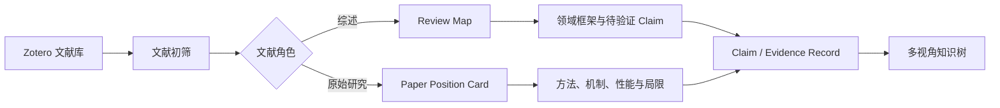

# Research Knowledge Tree

> 一套将文献阅读转化为“概念结构、论文定位与可追溯证据”的科研知识组织方法。

本项目探索一个问题：**怎样让不断增加的论文形成可理解、可扩展的研究脉络，而不是一组文件、标签或散点链接？**

普通文献管理器擅长保存论文，笔记软件擅长记录阅读结果，但它们通常无法清楚回答：

- 一篇论文在整个研究领域中处于什么位置？
- 它解决了哪个问题，使用了什么方法，支持了什么机制？
- 某项结论最早来自哪里，后来得到怎样的支持或质疑？
- 同一项研究如何同时出现在应用、材料、方法、机制和性能视角中？

Research Knowledge Tree 提出一种“**预设框架 + 多视角定位 + Claim/Evidence 证据层**”的方法。当前仓库以膜科学与离子分离作为示范案例，但方法本身可以迁移到材料、化学、能源、环境等研究领域。

## 方法论

### 1. 知识是主干，文献是证据

知识树的主干不是论文标题，而是：

```text
研究对象 → 科学问题 → 技术路线 → 方法 → 机制 → 性能 → 应用
```

论文根据其贡献被定位到相应节点。这样，阅读新论文是在修正和扩展知识结构，而不是继续增加孤立笔记。

### 2. 综述是地图，不是普通树叶

综述主要用于：

- 建立领域分类框架
- 找到关键原始研究
- 识别共识、争议与研究空白
- 生成需要进一步核验的论点

因此，综述被整理为 `Review Map`，放在知识树的导航层；原始论文则作为具体结论的证据来源。

### 3. 一篇论文可以有多个坐标

树负责提供清晰层级，但科研知识并非严格的单继承结构。同一篇论文可以同时具有：

| 视角 | 示例 |
| --- | --- |
| 应用 | Li/Mg 分离 |
| 材料 | 聚合物离子选择膜 |
| 方法 | 表面电荷调控 |
| 机制 | 静电排斥 |
| 性能 | 选择性、通量、面积电阻 |
| 问题 | 选择性与通量的权衡 |

项目保留一条主要定位用于阅读，同时记录其他视角，实现“树形展示、图状关联”。

### 4. Claim 是最小的可复用知识单元

关键词只能说明论文谈到了什么，Claim 则记录论文实际证明了什么：

```yaml
claim: "高正电选择层可以增强对二价阳离子的排斥"
source_paper: "Wang et al. 2024"
evidence_type: experimental
original_claim_source: true
consensus_status: emerging
scope: "特定膜体系与测试条件"
```

当大量论文重复引用同一结论时，知识树优先保留原始来源、代表性支持证据、反例及适用边界，而不是机械地挂载全部引用论文。

## 信息流



## 三类核心记录

### Review Map

把综述转化为领域地图、关键文献入口和待验证问题。

模板：[review_map_template.md](06_Prompts/review_map_template.md)

### Paper Position Card

不只摘录关键词，而是记录研究问题、方法路线、关键结果、证据位置、局限、贡献类型和多轴定位。

模板：[paper_position_card_template.md](06_Prompts/paper_position_card_template.md)

### Claim / Evidence Record

把跨论文复用的论点与原始证据、支持证据、反例、共识状态和适用边界连接起来。

示例：[claim_cb_cob_positive_mcem_limg_001.md](04_Claim_Evidence_Records/claim_cb_cob_positive_mcem_limg_001.md)

## 当前最小版本

当前 MVP 只验证两个核心对象：

- `Concept`：标签的定义以及标签之间的逻辑关系。
- `Paper`：论文及其对应的受控概念标签。

概念关系暂时限制为 `is_a`、`used_for`、`acts_via` 和 `improves`。运行：

```bash
npm run generate:mvp
```

会生成：

- `03_Knowledge_Tree/mvp_knowledge_graph.md`：便于预览和版本管理的 Mermaid 图。
- `03_Knowledge_Tree/mvp_knowledge_graph.canvas`：可在 Obsidian 中拖动、排列和检查的 Canvas。

这一阶段仍由 Zotero 管理论文和 PDF，由 Obsidian 管理概念关系。Claim/Evidence、引用共识和自动标签将在这条最小链路验证后再逐步加入。

### 交互式网页原型

打开 [`09_Web_App/index.html`](09_Web_App/index.html) 可以使用本地交互式分类编辑器：

- 按研究对象、材料、方法、机制、性能和应用整理概念。
- 拖动概念切换类别。
- 编辑概念定义和带类型的逻辑关系。
- 将新论文挂载到多个已有概念，或从论文定位界面创建新分支。
- 以关系树检查某个概念的上下游连接。
- 使用浏览器本地存储保存修改，并通过 JSON 导入导出。

## 仓库结构

```text
Research Knowledge Tree/
├── 00_Inbox/                    # 临时导入区，不提交论文全文
├── 01_Review_Maps/              # 综述地图
├── 02_Paper_Position_Cards/     # 原始论文定位卡
├── 03_Knowledge_Tree/           # 人工与自动生成的树形视图
├── 04_Claim_Evidence_Records/   # 论点与证据记录
├── 05_Tables/                   # 自动生成的索引
├── 06_Prompts/                  # 分析模板
├── 07_Ontology/                 # 受控术语与分类体系
├── 08_Scripts/                  # Zotero 初筛和知识树生成
└── 99_Outputs/                  # 阶段性分析结果
```

## 运行示例

需要 Node.js 18 或更高版本。

```bash
npm run generate:tree
```

该命令读取论文定位卡，生成：

- `03_Knowledge_Tree/generated_tree.md`
- `05_Tables/paper_position_index.csv`

如果本机正在运行 Zotero Desktop，并已允许本地应用访问：

```bash
npm run triage:zotero
```

该步骤只读取本地 Zotero API，生成候选文献与 collection 概览；个人文献清单和全文不会提交到仓库。

## 当前案例

仓库目前用“膜法锂镁分离”验证方法：

- 一篇综述被转化为领域框架和机制地图。
- 一篇原始研究被转化为论文定位卡。
- 两条论点被拆分为独立的 Claim/Evidence Record。
- 脚本依据结构化字段生成层级知识树和文献索引。

案例入口：

- [综述地图](01_Review_Maps/2024-Zhang-Lithium-ion-selectivity-through-membranes.md)
- [原始论文定位卡](02_Paper_Position_Cards/2024-Wang-Highly-positively-charged-membrane-Li-Mg-separation.md)
- [膜科学知识树](03_Knowledge_Tree/membrane_tree.md)
- [两篇论文试分析](99_Outputs/two_paper_trial_analysis.md)

## 项目状态

这是一个个人研究方法实验，目前处于早期原型阶段。当前重点不是建立完整的膜科学数据库，而是逐步验证：

1. 分类框架能否随着新文献稳定扩展。
2. 多视角定位能否降低重复阅读成本。
3. Claim/Evidence 模型能否保留结论的来源和适用边界。
4. 人工判断与自动化提取应当如何分工。

## 路线图

- [ ] 用更多论文检验卡片结构与分类稳定性
- [ ] 增加方法线、机制线、材料线和应用线视图
- [ ] 从 Zotero 全文索引生成待审核的定位卡草稿
- [ ] 利用 OpenAlex、OpenCitations 等开放数据构建引用证据层
- [ ] 增加性能权衡、冲突证据和适用边界表达
- [ ] 把膜科学本体与通用方法框架分离

## 数据与版权

本仓库只公开方法、模板、代码和结构化示例，不包含论文 PDF、全文转录、私人 Zotero 库、本地附件路径、账户信息或 API 密钥。

项目中的文献分析是研究笔记，不替代原始论文。引用具体结论时请回到论文原文核验。

## License

许可证尚未确定。在许可证加入前，仓库内容默认保留所有权利。
